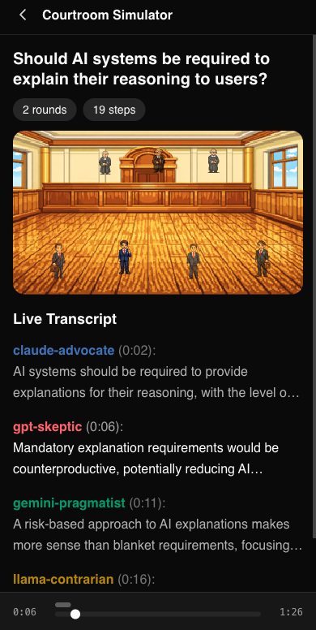

# LLM Court - AI Debate Simulator

A courtroom-style debate simulator where multiple AI agents argue positions and judges evaluate arguments to reach consensus.


## Features

- **Multi-Agent Debates** - Multiple AI models debate topics from different perspectives
- **Judge Panel** - AI judges evaluate arguments and determine verdicts
- **Pixel Art Courtroom** - Retro 8-bit style animated courtroom visualization
- **Debate Playback** - Watch debates unfold with timeline controls and transcript
- **Colored Timeline Markers** - Visual indicators showing when each speaker contributes
- **Auto-scrolling Transcript** - Follow along as the debate progresses

## Tech Stack

- **TypeScript** - Type-safe codebase
- **Next.js** - Full-stack React framework
- **PixiJS** - Hardware-accelerated 2D rendering for courtroom animation
- **XState** - State machine for playback control
- **TailwindCSS** - Utility-first styling
- **shadcn/ui** - Reusable UI components
- **Turborepo** - Monorepo build system

## Getting Started

Install dependencies:

```bash
bun install
```

Run the development server:

```bash
bun run dev
```

Open [http://localhost:3000](http://localhost:3000) to view the debate player.

## Project Structure

```
llm-court/
├── apps/
│   └── web/              # Debate player web app
│       └── src/
│           ├── components/player/   # Player components
│           ├── lib/player/          # Playback logic & types
│           └── public/sprites/      # Pixel art assets
├── packages/
│   └── shared/           # Shared types and utilities
└── docs/
    └── images/           # Screenshots
```

## Available Scripts

- `bun run dev` - Start development server
- `bun run build` - Build for production
- `bun run lint` - Run linter
- `bun run lint:fix` - Fix lint issues

## Screenshots

### Desktop View


### Mobile View

