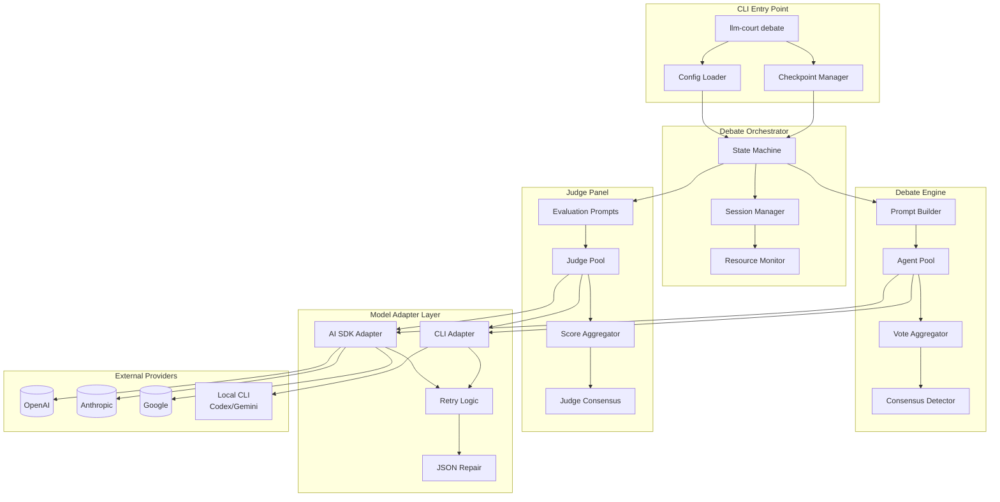
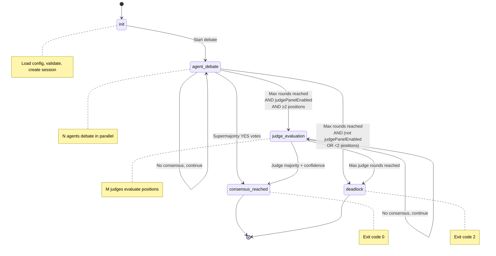
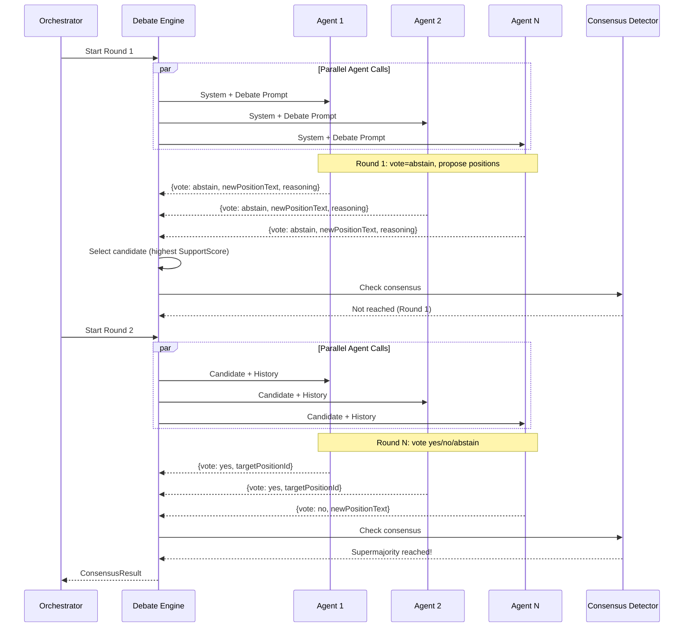
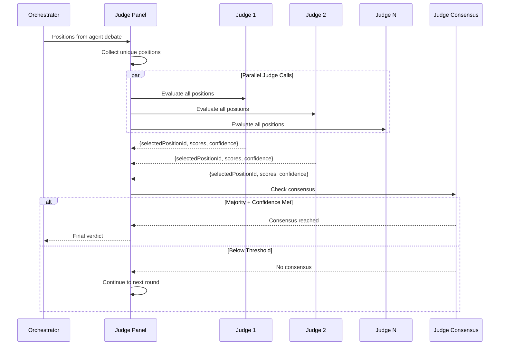
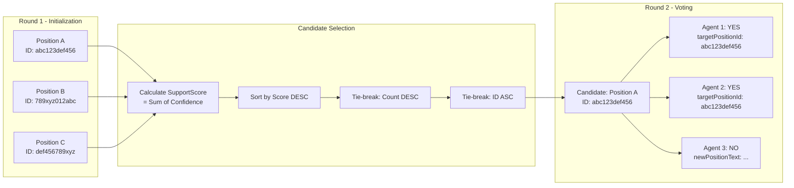
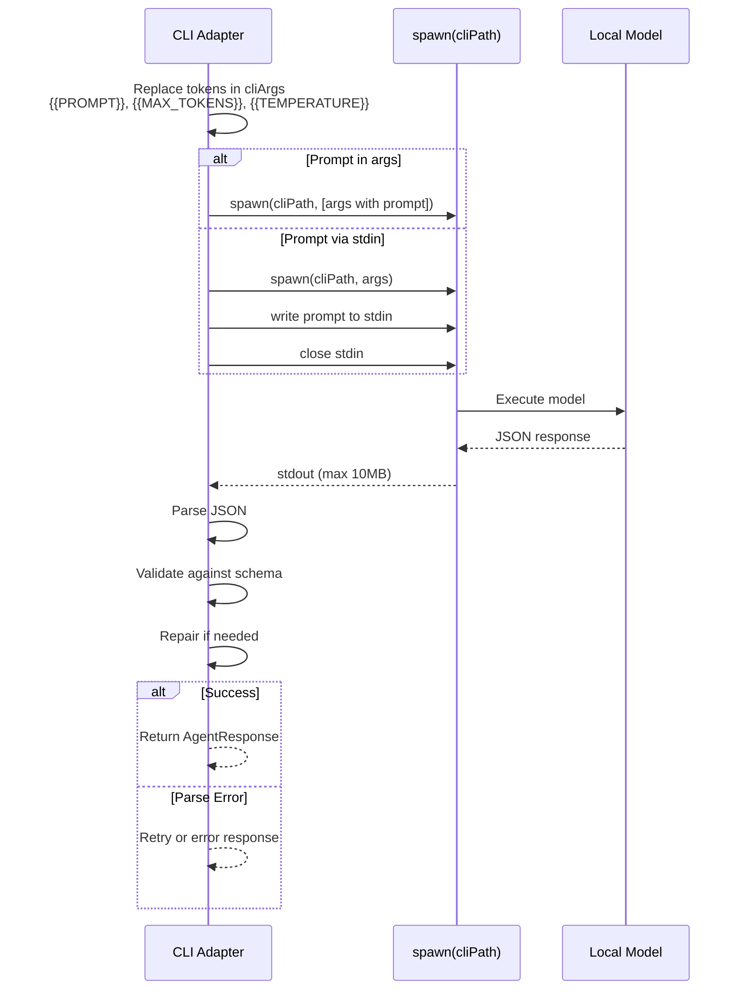
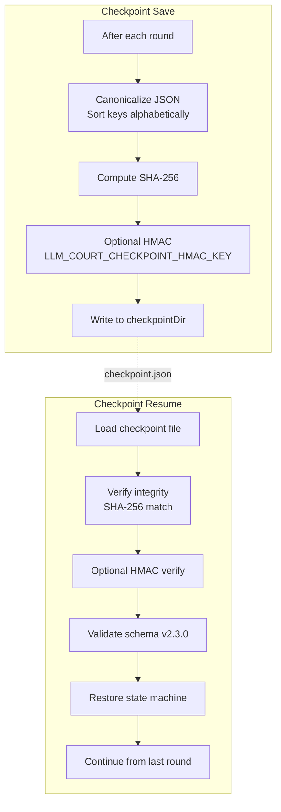
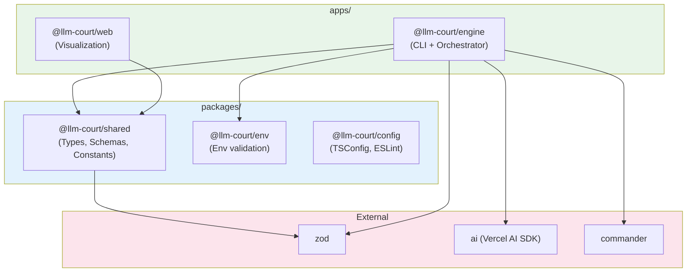
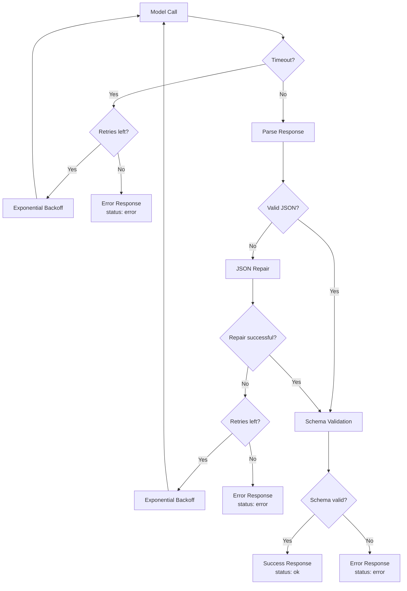
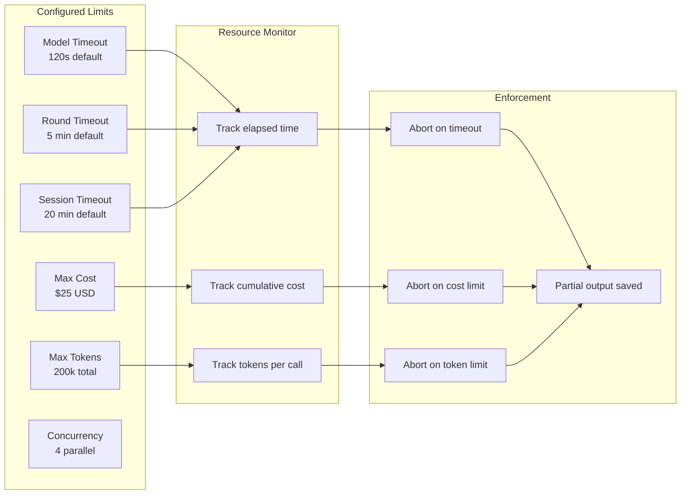

# LLM Court (Agora) - Architecture Diagrams

> Generated from Technical Specification v2.3.0

## System Overview



## State Machine



## Agent Debate Flow



## Judge Panel Flow



## Position Tracking & Voting



## Consensus Detection Algorithm

```mermaid
flowchart TD
    Start([Round Complete]) --> Filter[Filter eligible responses<br/>status = ok]

    Filter --> Count[Count votes]

    Count --> VotingTotal[votingTotal = yes + no<br/>Exclude abstains]

    VotingTotal --> Check{votingTotal > 0?}

    Check -->|No| NoConsensus[No Consensus<br/>Continue to next round]

    Check -->|Yes| Threshold[Calculate threshold<br/>= ceil(votingTotal × 0.67)]

    Threshold --> Compare{yes ≥ threshold?}

    Compare -->|No| NoConsensus

    Compare -->|Yes| Consensus[Consensus Reached!<br/>Return winning position]

    NoConsensus --> MaxRounds{Max rounds<br/>reached?}

    MaxRounds -->|No| NextRound[Next Round]
    MaxRounds -->|Yes| JudgeCheck{judgePanelEnabled<br/>AND ≥2 positions?}

    JudgeCheck -->|Yes| JudgePhase[Enter Judge Evaluation]
    JudgeCheck -->|No| Deadlock[Deadlock<br/>Exit code 2]
```

## Model Adapter Architecture

```mermaid
flowchart TB
    subgraph Interface["Adapter Interface"]
        I[ModelAdapter<br/>call(prompt): Response]
    end

    subgraph Registry["Adapter Registry"]
        R[getAdapter(config)]
    end

    subgraph Implementations["Implementations"]
        AI[AI SDK Adapter<br/>OpenAI, Anthropic, Google]
        CLI[CLI Adapter<br/>Local models via spawn]
    end

    subgraph Middleware["Middleware Layer"]
        RT[Retry Logic<br/>Exponential backoff]
        JR[JSON Repair<br/>Fix malformed output]
        TO[Timeout Enforcement]
    end

    subgraph Output["Response Processing"]
        V[Zod Validation]
        E[Error Normalization]
    end

    R --> AI
    R --> CLI

    AI --> RT
    CLI --> RT

    RT --> TO
    TO --> JR
    JR --> V
    V --> E

    E --> I

    style Interface fill:#e1f5fe
    style Middleware fill:#fff3e0
```

## CLI Provider Contract



## Checkpoint & Resume



## Package Dependencies



## Error Handling Flow



## Resource Limits


