# LLM Court Debate Player – Architecture Diagrams v2.5.0

This document provides visual architecture diagrams for the Debate Player component.

## 1. System Context Diagram

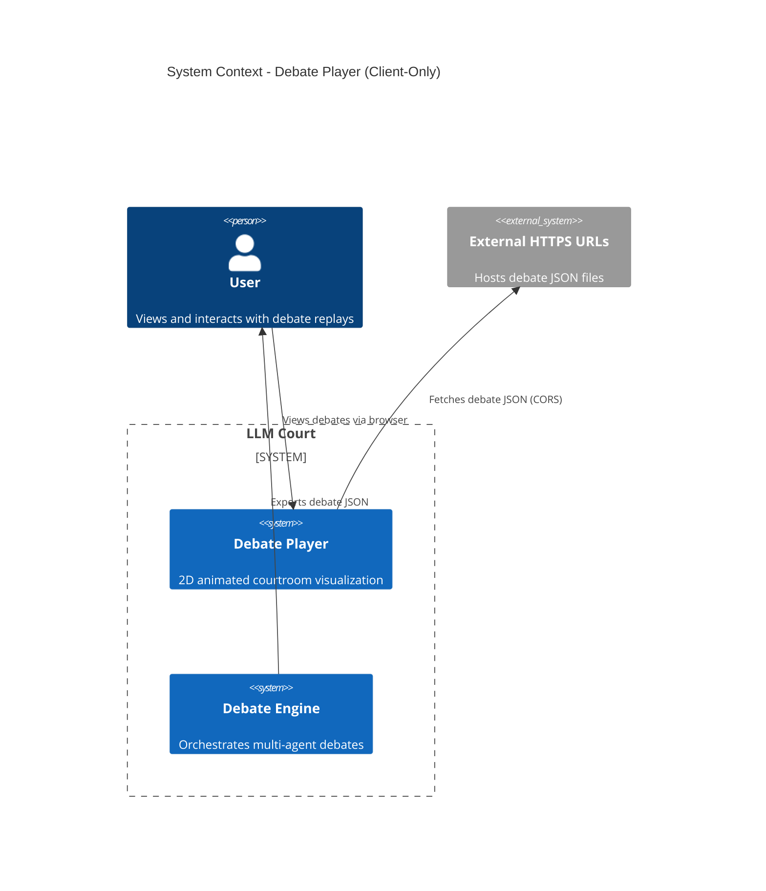

## 2. Component Architecture

```mermaid
graph TB
    subgraph "Next.js App (apps/web)"
        subgraph "Player Page"
            PAGE["/player"]
            XSTATE[(XState Machine)]
            CLOCK[Clock Actor]
            REFS[TimeRef + SpeedRef]
        end

        subgraph "React Components"
            PLAYER[DebatePlayer]
            CANVAS[CourtroomCanvas]
            TIMELINE[Timeline]
            INFO[InfoPanel]
            SPEECH[SpeechBubble]
            TRANSCRIPT[TranscriptPanel]
            DROPZONE[DebateDropZone]
        end

        subgraph "PixiJS Layer"
            STAGE[Stage]
            AGENTS[AgentSprites]
            JUDGES[JudgeSprites]
            BG[Background]
        end

        subgraph "Data Sources"
            FILE[File Upload]
            URL[URL Parameter]
            LOCAL[localStorage]
        end
    end

    subgraph "Assets"
        ASSETS[/sprites/manifest.json]
    end

    FILE --> DROPZONE
    URL --> PAGE
    LOCAL --> PAGE

    PAGE --> XSTATE
    XSTATE --> CLOCK
    CLOCK --> REFS
    REFS --> CANVAS

    PAGE --> PLAYER
    PLAYER --> CANVAS
    PLAYER --> TIMELINE
    PLAYER --> INFO
    PLAYER --> TRANSCRIPT

    CANVAS --> STAGE
    STAGE --> AGENTS
    STAGE --> JUDGES
    STAGE --> BG
    CANVAS --> SPEECH

    CANVAS -.-> ASSETS
```

## 3. Data Flow

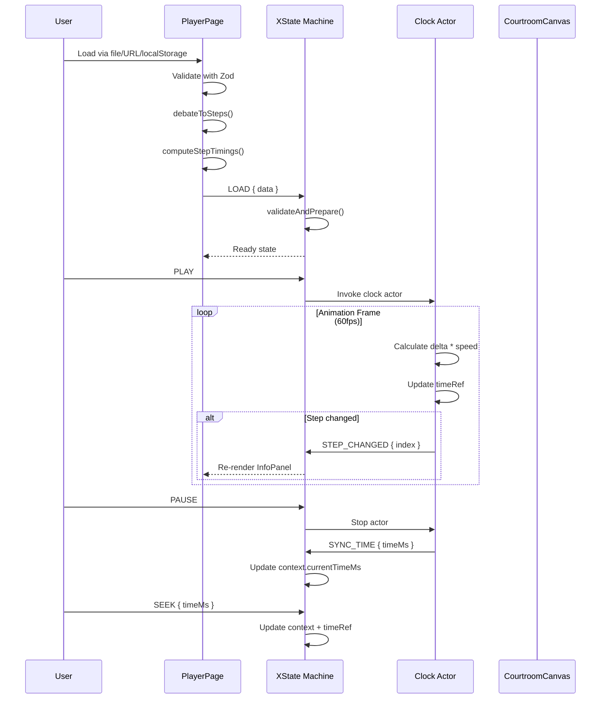

## 4. PlaybackStep Linearization

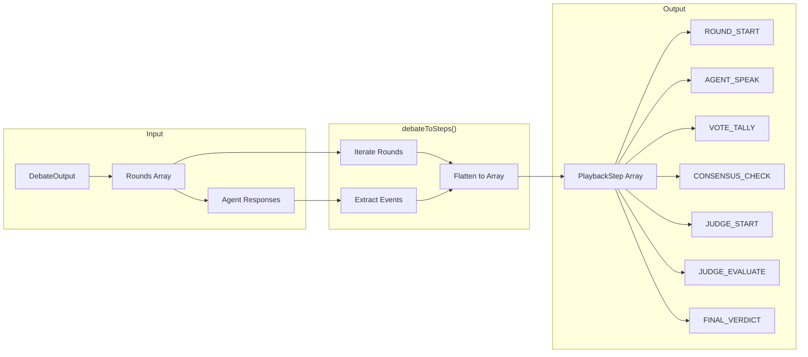

## 5. XState State Machine

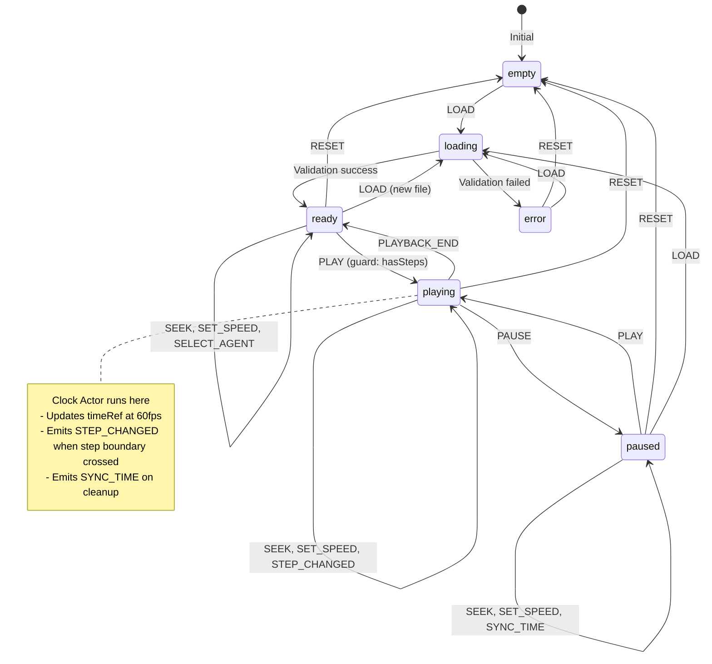

## 6. Component Hierarchy

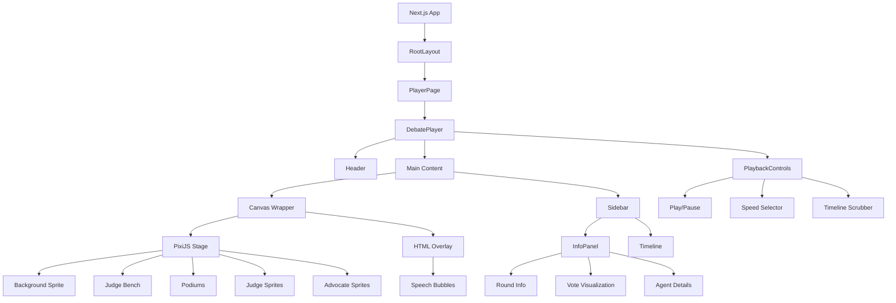

## 7. Data Loading Flow

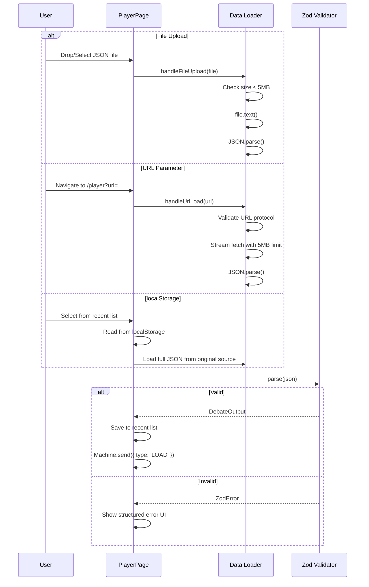

## 8. Playback Clock Timing

```mermaid
gantt
    title Example Debate Timeline (3 rounds, 2 agents)
    dateFormat X
    axisFormat %s

    section Round 1
    ROUND_START      :r1_start, 0, 2000
    Agent 1 speaks   :a1_r1, after r1_start, 5000
    Agent 2 speaks   :a2_r1, after a1_r1, 4500
    Vote Tally       :v1, after a2_r1, 3000
    Consensus Check  :c1, after v1, 2500

    section Round 2
    ROUND_START      :r2_start, after c1, 2000
    Agent 1 speaks   :a1_r2, after r2_start, 6000
    Agent 2 speaks   :a2_r2, after a1_r2, 5500
    Vote Tally       :v2, after a2_r2, 3000
    Consensus Check  :c2, after v2, 2500

    section Verdict
    Final Verdict    :verdict, after c2, 4000
```

## 9. Error Handling Flow

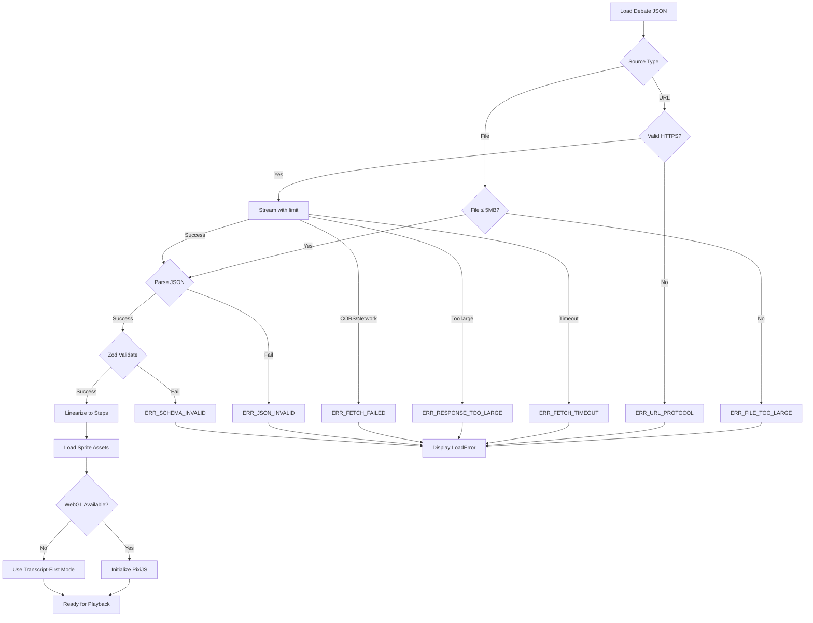

## 10. Two-Tier Update Architecture

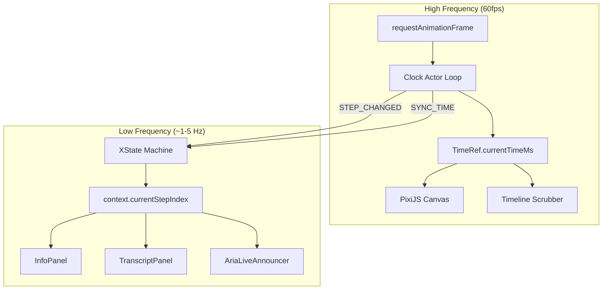

## 11. Sprite Animation States

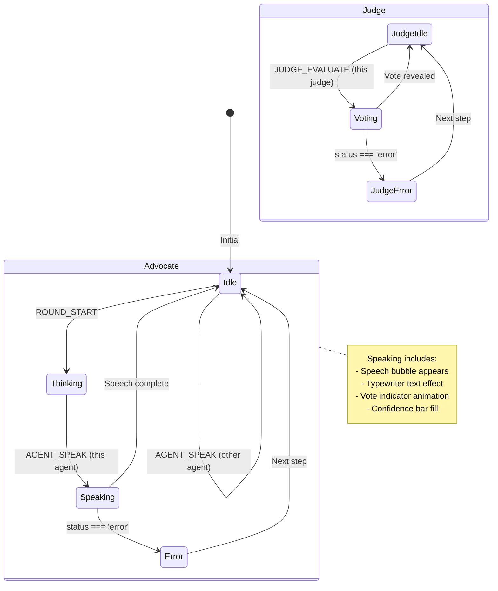

## 12. Security Architecture (Client-Only)

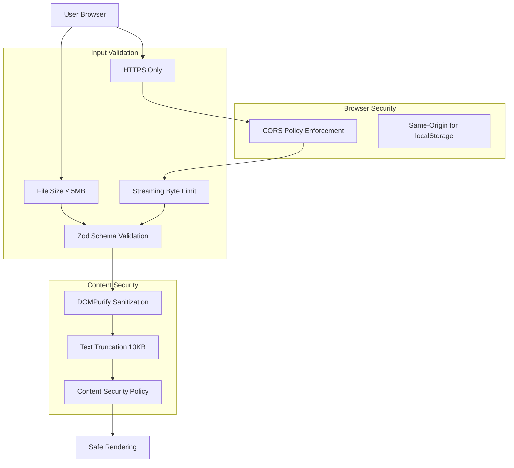

## 13. Responsive Layout Architecture

```mermaid
flowchart TB
    subgraph "≥1024px (Desktop)"
        DESKTOP_CANVAS[PixiJS Canvas]
        DESKTOP_SIDE[Sidebar: Info + Timeline]
        DESKTOP_CONTROLS[Playback Controls]
        DESKTOP_CANVAS --- DESKTOP_SIDE
        DESKTOP_SIDE --- DESKTOP_CONTROLS
    end

    subgraph "768-1023px (Tablet)"
        TABLET_CANVAS[PixiJS Canvas - Stacked]
        TABLET_INFO[Info Panel Below]
        TABLET_CONTROLS[Playback Controls]
        TABLET_CANVAS --- TABLET_INFO
        TABLET_INFO --- TABLET_CONTROLS
    end

    subgraph "<768px (Mobile)"
        MOBILE_HEADER[Header]
        MOBILE_TRANSCRIPT[Virtualized Transcript]
        MOBILE_SCRUBBER[Simple Scrubber]
        MOBILE_CONTROLS[Play/Pause]
        MOBILE_HEADER --- MOBILE_TRANSCRIPT
        MOBILE_TRANSCRIPT --- MOBILE_SCRUBBER
        MOBILE_SCRUBBER --- MOBILE_CONTROLS
    end

    note right of MOBILE_TRANSCRIPT
        No PixiJS on mobile
        Text-only transcript-first mode
        Uses react-window virtualization
    end note
```

---

## Implementation Notes

### Diagram Legend

| Symbol | Meaning |
|--------|---------|
| Rectangle | Component/Service |
| Cylinder | State Store |
| Diamond | Decision point |
| Parallelogram | Input/Output |
| Rounded Rectangle | Process |

### Mermaid Rendering

These diagrams use [Mermaid](https://mermaid.js.org/) syntax. To view:
- GitHub renders them natively in markdown preview
- VS Code with Mermaid extension
- [Mermaid Live Editor](https://mermaid.live/)

### Related Documents

- [0-spec.md](./0-spec.md) - Full technical specification v2.5.0
- [packages/shared/src/types.ts](/packages/shared/src/types.ts) - TypeScript types
- [apps/engine/README.md](/apps/engine/README.md) - Debate engine docs

### Key Architecture Changes (v2.5.0)

1. **No Database**: Removed PostgreSQL; debates loaded via file upload, URL, or localStorage
2. **XState over Zustand**: Finite state machine for explicit state transitions
3. **Clock Actor Pattern**: Callback actor for 60fps updates with ref-based time sync
4. **Streaming Fetch**: Safe URL loading with byte-limit enforcement
5. **Mobile-First Transcript**: No PixiJS on mobile; virtualized text view
